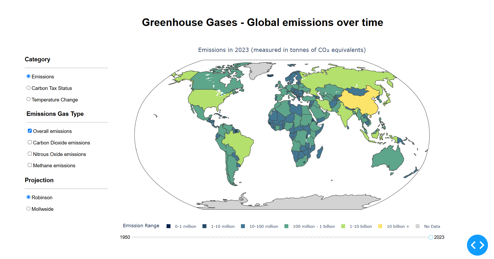
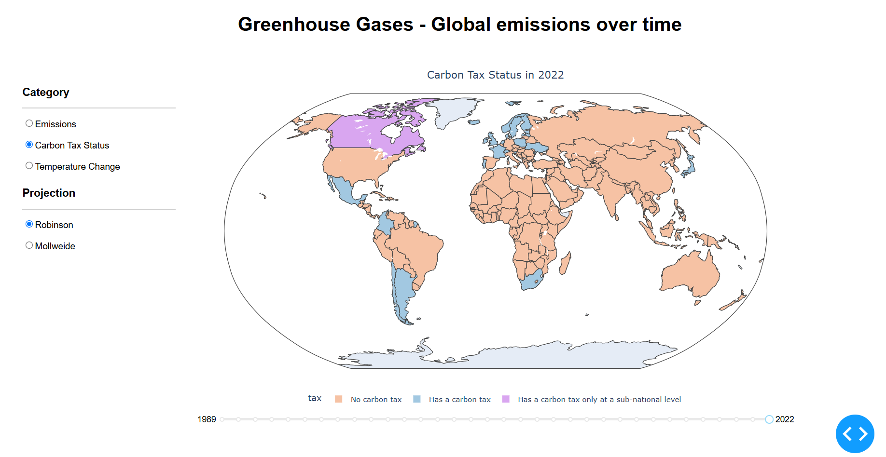
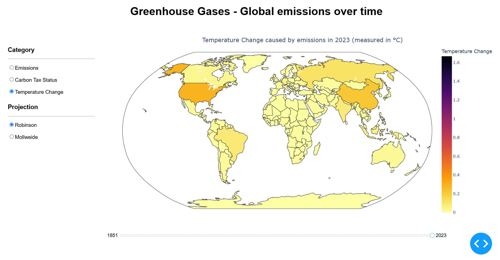

# 🌍 Global Greenhouse Gas Emissions: Visualization & Prediction  

  
  
  
  
  
  
  
  

## 📌 Project Overview  
This project provides **a dual analysis of greenhouse gas (GHG) emissions** using:  
- **📊 Visualization Dashboard** (**Plotly Dash**) → **Total GHG emissions** (**CO2, CH4, N2O**) across countries, carbon tax policies, and temperature changes.  
- **🔍 Data Analysis & Prediction** (**BigQuery, Looker Studio, Machine Learning**) → **Per capita GHG emissions**, querying trends, and predicting future emissions.  
- **🌎 Static Website Deployment** (**Google Cloud Storage**) → A **Choropleth Map** visualizing **per capita GHG emissions across the globe**, allowing users to interact with **yearly data through a slider**.  

🔹 **[📂 Visualization Dashboard (Plotly Dash)](Visualization_Dashboard/README.md)**  
🔹 **[📂 Machine Learning & Cloud Analytics (BigQuery & GCP)](ML-Prediction/README.md)**  

---

## 🛠 Tools & Technologies  
- **Python, Pandas, NumPy** → Data wrangling & transformations  
- **Plotly Dash** → Interactive dashboards & Choropleth maps  
- **Google Cloud Platform (GCP)** → Cloud data storage, static website hosting  
- **BigQuery** → Large-scale SQL querying & analysis  
- **Looker Studio** → Data visualization & reporting  
- **Machine Learning** → Linear Regression, Gradient Boosting Regressor  
- **GCP Static Hosting** → Hosting the per capita emissions **Choropleth Map**  

---

## 📂 Project Structure  

---

## 🔍 Approach  

### **🌍 1. Visualization Component (Plotly Dash)**
#### **Data Preprocessing**
- **Merged datasets** for **CO2, CH4, N2O emissions, carbon tax policies, and temperature changes**.  
- **Converted data into tidy & hybrid formats** for visualization.  
- **Cleaned missing values** using forward fill and mean imputation.  

#### **App Layout**
📌 **Side Menu (User Controls)**  
- **Category Selection:** (Emissions, Carbon Tax, Temperature)  
- **Gas Type Filter:** (CO2, CH4, N2O)  
- **Projection Type:** (Robinson, Mollweide)  
- **Year Slider:** Interactive filter for temporal analysis  

📌 **Main Visualization Area**  
- **Choropleth Map:** Displays global emissions with dynamic tooltips  
- **Hover Interaction:** Displays country-specific emission values  

#### **Callbacks & Interactivity**  
📌 **Update Figure Function** → Dynamically updates the Choropleth map based on filters.  
📌 **Toggle Emissions Options** → Adjusts UI controls based on selection.  
📌 **Collapsible Menu Toggle** → Handles sidebar interactions.  

#### **Deployment**  
- **Local:** Run `app.py`.   

---

### **2️⃣ Per Capita GHG Emissions Analysis (BigQuery, ML & GCP Deployment)**  
This section includes **data extraction, analysis, predictions, and visualization** of **per capita greenhouse gas (GHG) emissions**.  

#### **2.1 BigQuery & Looker Studio Analysis**  
- **Stored per capita emissions data in GCP buckets** and queried using **BigQuery SQL**.  
- **Generated insights in Looker Studio dashboards**.  
- **Extracted key trends:**  
  - **Top 10 emitters per capita**.  
  - **GHG emissions trends from 1981-2023**.  
  - **Correlation between GDP, energy use, and emissions**.  

#### **2.2 Machine Learning Predictions**  
- **Trained Linear Regression & Gradient Boosting models** to predict per capita emissions.  
- **Achieved 96% accuracy** using feature engineering & data transformations.  
- **Evaluated models with R² and Mean Squared Error (MSE)**.  

#### **2.3 Static Website Deployment (Google Cloud)**  
- **Built a Choropleth Map** for **per capita GHG emissions**.  
- **Added an interactive year slider** for time-based analysis.  
- **Hosted as a static website on GCP** for global accessibility.  
 
---

## 📊 Results  
- **Visualized global GHG emission trends** over time.  
- **Mapped the impact of carbon tax policies**.  
- **Predicted per capita GHG emissions with ML models**.  
- **Deployed a static Choropleth Map for global accessibility**.  

---

## 📸 Visuals  

### 🌍 Global Greenhouse Gas Emissions  
Displays **CO2, CH4, and N2O emissions** by country over time.  
  

### 💰 Carbon Tax Policy Status  
Shows **countries with implemented carbon tax policies** and their effectiveness.  
  

### 🌡️ Temperature Change Analysis  
Illustrates **the impact of emissions on global temperature trends**.  
  

### 🌎 **GCP Hosted Choropleth Map**  
  

---

---

## 🚀 Future Enhancements  
- **Expand ML models** to include deep learning for better predictions.  
- **Host the visualization as a web app for public accessibility**.  
- **Integrate additional datasets** like industrial emissions & renewable energy trends.  

--- 
